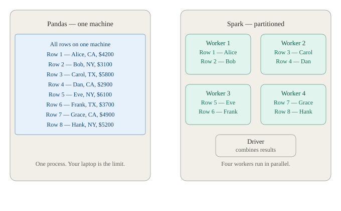
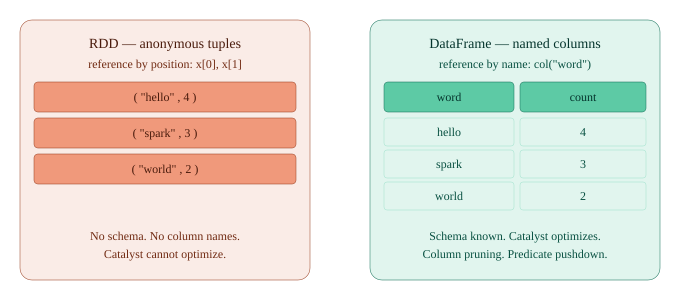
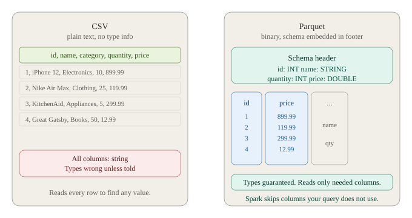
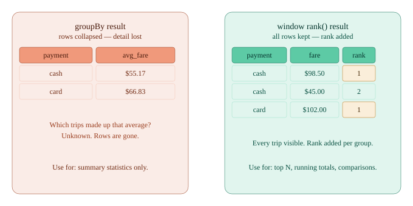

# PySpark tutorial for beginners

A collection of 8 Jupyter notebooks teaching PySpark from environment setup
to Spark SQL — designed to run on Google Colab with zero local setup.

---

## Quick start

1. Click the badge above to open Notebook 01 in Colab
2. Run the **setup cell** first (installs pyspark)
3. Run the **data bootstrap cell** (downloads the NYC TLC dataset)
4. Work through the notebooks in order

> **Note:** The original tutorial was written for a local Mac installation.
> This fork fixes all Colab compatibility issues and replaces synthetic data
> with the [NYC TLC Yellow Taxi dataset](https://www.nyc.gov/site/tlc/about/tlc-trip-record-data.page)
> for more realistic exercises.

---

## What changed from the original

| Issue | Fix |
|-------|-----|
| `os.environ SPARK_HOME` cell hardcoded a local Mac path | Deleted — replaced with `pip install pyspark` setup cell |
| All data paths used `./data/` (relative) | Changed to `/content/data/` (absolute, works in Colab) |
| `df.write` failed on re-run | Added `.mode("overwrite")` to all write cells |
| `git clone` failed on re-run | Added existence check before clone |
| Synthetic sample data with 5-20 rows | Replaced with NYC TLC dataset (~3M rows, 19 real columns) |

---

## Dataset

All notebooks use the **NYC TLC Yellow Taxi Trip Records (January 2023)**.

Downloaded automatically by the bootstrap cell in Notebook 01.

Key columns: `VendorID`, `tpep_pickup_datetime`, `fare_amount`,
`tip_amount`, `total_amount`, `payment_type`, `trip_distance`, `passenger_count`

---

## Stage structure

### Stage 1 — Environment & architecture (Notebooks 01–03)

Covers: SparkSession, SparkContext, Catalyst optimizer, logical vs physical plan,
lazy evaluation, `local[*]` master, key config options.

**Test yourself:**
1. What is the difference between SparkContext and SparkSession?
2. Why does `getOrCreate()` exist instead of `create()`?
3. What does `local[*]` mean in the master field?
4. What does the Catalyst optimizer do and when does it run?
5. What is the difference between a logical plan and a physical plan?

---

### Stage 2 — RDDs (Notebook 04)

Covers: transformations vs actions, lazy evaluation, `map`, `filter`,
`flatMap`, `reduce`, `collect`, `take`, `foreach`.

**Test yourself:**
1. What is the difference between a transformation and an action?
2. Why does `foreach()` produce no output in a notebook?
3. Why should you never use `collect()` on a large dataset?
4. What does this produce: `[1..10].filter(even).map(square).reduce(sum)`?
5. What does resilient mean in RDD?

---

### Stage 3 — DataFrames (Notebooks 05–07)

Covers: schema, `printSchema()`, `show()`, `count()`, reading CSV/JSON/Parquet,
write modes, `select`, `filter`, `withColumn`, `groupBy`, `agg`, `join`,
null handling, `explode`, `split`.

**Test yourself:**
1. What is the difference between an RDD tuple and a DataFrame Row?
2. Why does `printSchema()` on a Parquet file return instantly?
3. What happens if you read a CSV without `inferSchema=True`?
4. What does `withColumn` do if the column name already exists?
5. Why is Parquet faster than CSV for analytical queries on wide tables?
6. What does `explode` require as its input type?

---

### Stage 4 — Spark SQL (Notebook 08)

Covers: `createOrReplaceTempView`, `spark.sql()`, SQL vs DataFrame API
performance, window functions (`rank`, `dense_rank`, `lag`, `lead`).

**Test yourself:**
1. How do you make a DataFrame queryable with SQL in Spark?
2. What is the performance difference between Spark SQL and the DataFrame API?
3. What does a window function like `rank()` do that `groupBy` cannot?
4. What is the difference between `rank()` and `dense_rank()`?

---

### Stage 5 — Intermediate (beyond this repo)

Topics to explore next:
- Partitioning: `repartition()`, `coalesce()`, `spark.sql.shuffle.partitions`
- Reading execution plans: `df.explain(True)`
- Broadcast joins: `df.join(broadcast(small_df), "id")`
- Databricks: pre-injected session, `display()` vs `show()`
- Portfolio project: 5 business questions on the NYC TLC dataset using only PySpark

---

## Notebook descriptions

| Notebook | Topic |
|----------|-------|
| 01-PySpark-Get-Started | Environment setup, SparkSession creation |
| 02-Create-SparkContext | SparkContext and its relationship to SparkSession |
| 03-Create-SparkSession | Session config options and builder pattern |
| 04-RDD-Operations | RDD transformations, actions, lazy evaluation |
| 05-DataFrame-Intro | DataFrame basics, schema, show, printSchema |
| 06-DataFrame-from-various-data-source | Reading CSV, JSON, Parquet; write modes |
| 07-DataFrame-Operations | select, filter, join, groupBy, withColumn, nulls |
| 08-Spark-SQL | Temp views, Spark SQL, window functions |

---

## Contributing

Found an issue or want to add a notebook? PRs welcome.
See [AGENTS.md](AGENTS.md) for AI-assisted teaching guidance.

## License

MIT
